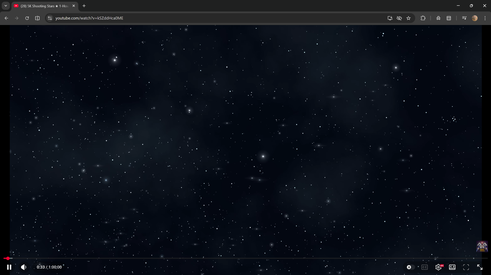
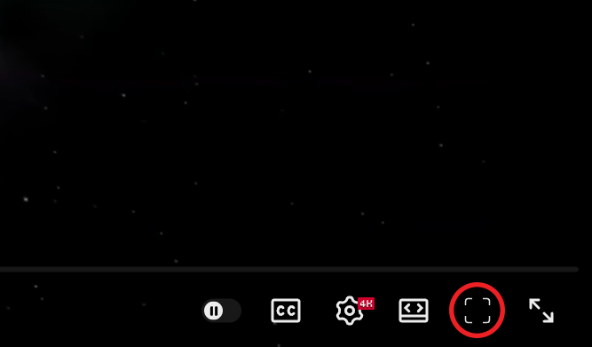
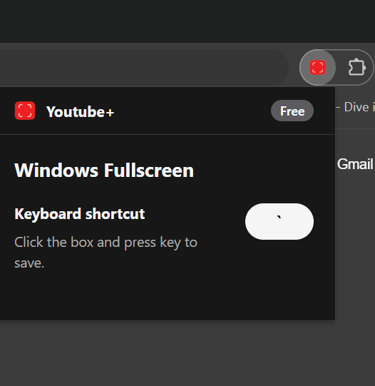

# YouTube Windowed Fullscreen (Chrome Extension)

A lightweight Chrome extension for YouTube that adds a windowed fullscreen mode, so videos can fill the browser window without using native fullscreen.

### Windowed fullscreen mode

<table align="center">
  <tr>
    <td align="center">
      
       
      Custom player control button
    </td>
    <td align="center">
      
       
      Popup shortcut settings
    </td>
  </tr>
</table>

## Features

- Adds a custom button next to YouTube's fullscreen controls.
- Toggles a windowed/viewport fullscreen mode on `youtube.com/watch` pages.
- Exits **cleanly** when native fullscreen or theater mode takes over.
- Supports a customizable keyboard shortcut (saved with `chrome.storage.sync`).
- Prevents assigning keys that conflict with default YouTube shortcuts.

## How it works

When enabled, the extension adds a class (`ext-yt-vfs`) to the root document and applies scoped CSS to promote YouTube's `#player-container` into a fixed, viewport-sized layer. This keeps the video contained within the browser window while hiding surrounding page chrome.

## Installation (Developer Mode)

1. Download or clone this repository.
2. Open `chrome://extensions` in Chrome.
3. Enable **Developer mode** (top-right).
4. Click **Load unpacked**.
5. Select this project folder.

## Usage

1. Open any YouTube watch page (URL path: `/watch`).
2. In the player controls, click the new viewport fullscreen button (expand-corners icon).
3. Click again to exit.

### Keyboard shortcut

- Open the extension popup from the Chrome toolbar.
- Click the shortcut input and press a key to save.
- Default shortcut: `` ` `` (backtick).
- Reserved YouTube keys (for example `f`, arrows, `0`-`9`, `k`, `m`) are blocked.

## Project structure

- `manifest.json` - extension manifest (MV3), content script registration, popup wiring.
- `content.js` - button injection, mode toggle logic, observers, and hotkeys.
- `content.css` - viewport fullscreen styles applied under `.ext-yt-vfs`.
- `popup/popup.html` - popup UI.
- `popup/pop.css` - popup styling.
- `popup/popup.js` - shortcut configuration logic.
- `docs/images/` - screenshots used in the README.
- `icons/` - extension icons.
